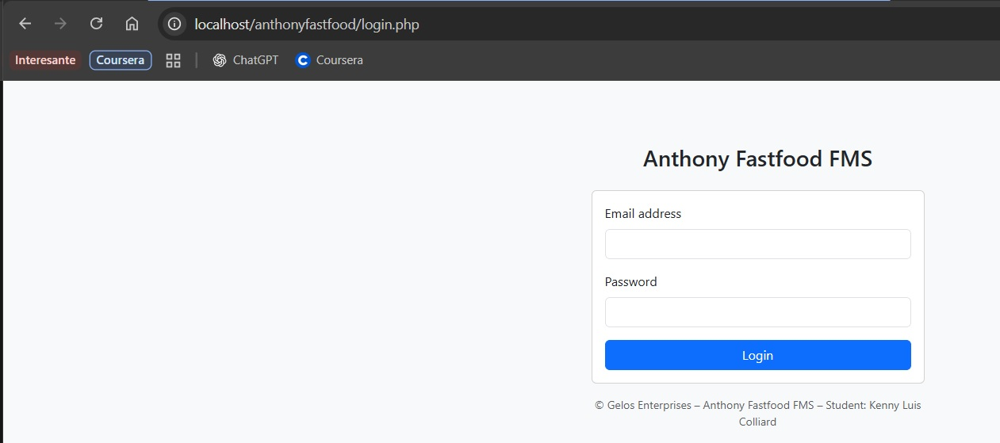
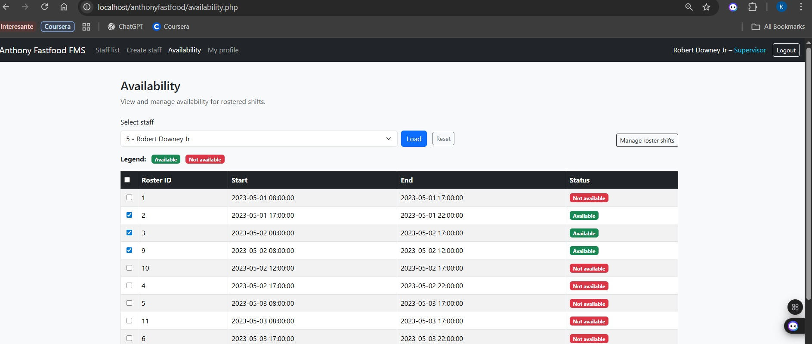

# Anthony’s Fast Food – Management System (FMS)

A full stack **staff and roster management system** developed using **PHP and MySQL** as part of the *Diploma of Information Technology (Database Management)*.

This project demonstrates practical skills in **database design, relational integrity, backend development, and system documentation**, focusing on real-world business requirements rather than theoretical examples.

---

## 🧩 Project Overview

The system was designed to support a fast-food business by managing:

- Staff records
- Roles and permissions
- Rosters and shifts
- Staff availability
- Secure authentication
- Data integrity through relational constraints

The application integrates a relational database with a PHP-based web interface to support operational decision-making and daily staff management.

---

## 🛠️ Technologies Used

- **PHP** – server-side logic
- **MySQL** – relational database
- **phpMyAdmin** – database management
- **HTML / CSS** – basic interface
- **XAMPP** – local development environment

---

## 🧠 Key Design Decisions

- **AUTO_INCREMENT primary keys** for all core tables  
- **Foreign keys with cascading rules** to prevent orphan records  
- **Unique constraints**, including:
  - Unique staff email
  - Unique staff availability per roster
  - Unique role per roster
- **Passwords stored as hashed values**
- Separation of concerns between database, logic, and presentation

The full database schema and sample data are included in:

database/fastfood_klc.sql

---

## 📁 Project Structure

anthony-fastfood-fms/
├── src/ # PHP application source code
├── database/ # SQL schema and sample data
├── screenshots/ # Application and database screenshots
└── README.md

---

## 📸 Screenshots

### Database Schema

### Login & Authentication

### Staff Management

### Availability Management

### Roster Management

### Create Staff

---

## ▶️ Running the Project Locally (Optional)

This project was developed and tested locally using **XAMPP**.

If you would like to run the system locally:

1. Install **XAMPP**
2. Start **Apache** and **MySQL**
3. Import the database:
   - Open phpMyAdmin
   - Create a database named `fastfood_klc`
   - Import `database/fastfood_klc.sql`
4. Place the contents of the `src/` folder inside:
htdocs/

5. Update database connection settings if required
6. Access the application via:
http://localhost/

---

## 📦 Source Code

The full PHP application source code is available in the `src/` directory.

For convenience, a compressed version of the source code is also provided:

- `anthony-fastfood-fms-source.zip`

This allows reviewers to quickly download and inspect the application without cloning the repository.

---

## 📚 What I Learned

Through this project, I strengthened my understanding of:

- Relational database design and normalization
- Foreign keys, cascading rules, and data integrity
- Backend logic using PHP
- Connecting web applications to databases
- Structuring and documenting a complete IT project

---

## 👤 Author

**Kenny Colliard**  
Junior Data Analyst | IT & Data Systems  

This project is part of my professional portfolio and reflects my interest in **data, IT systems, and practical, real-world applications**.
